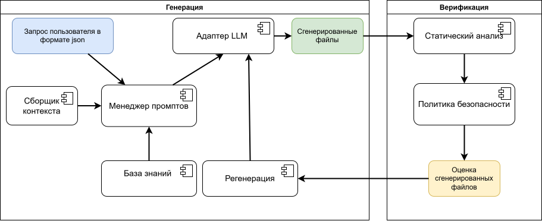

## Структура проекта

- generated/
  - [agent.py](generate/agent.py) &mdash; LLM Слой;
  - [context_collector.py](context_collector.py) &mdash; Сборщик контекста;
  - [knowledge_base.py](generate/knowledge_base.py) &mdash; База знаний;
  - [pompt_manager.py](prompt_manager.py) &mdash; Менеджер промптов;
  - [regenerator.py](generate/regenerator.py) &mdash; Регенератор.
- verify/
  - [static_analyzer.py](verify/static_analyzer.py) &mdash; Статичный анализ;
  - [security_policy.py](verify/security_policy.py) &mdash; Политики безопасности;
  - [verifier.py](verify/verifier.py) &mdash; Оркестратор верификацииж;
- [config](config.py) &mdash; Конфигурация проекта.

## Диаграмма компонентов



## Описание компонентов системы

### База знаний

База знаний является хранилищем структурированных знаний системы и не содержит никакой исполнемой логики,
за исключением функции сборки промпта.

Модуль определяет два словаря и реализует одну функцию:
- __GENERATORS__ &mdash; содержит описание каждого типа генерируемого файла: 
его имя на диске и системный промпт, который задает языковой модели роль, форматирования вывода и требования к содержимому. 
Системный и пользовательский промпт разделены: системный отвечает за то, как генерировать скрипт, а пользовательский &mdash; что генерировать.
- __TECH_HINTS__ &mdash; сопоставляет имена файлов-маркеров с текстовыми подсказками о технологическом стеке. 
На основании этих подсказок контекстный сборщик идентифицирует язык и фреймворк проекта.
- __get_system_prompt()__ &mdash; функция, которая принимает ключ генератора и список технических подсказок, найденных в проекте.
Если подсказки есть, то они дописываются в конец системного промпта.

### Сборщик контекста

Сборщик контекста отвечает за автоматическое извлечение информации из указанного проекта на основе анализа его файловой структуры. 
Логика компонента построена на прямом обходе файловой системы и определения характеристик проекта через подсказки из базы знаний.

Функция `collect()` принимает путь к директории проекта. Сначала она ищет в корне проекта файлы, соответствующи ключам в `TECH_HINTS`.
Если найден: 
- `pom.xml` &mdash; Java/Kotlin проект со сборщиком Maven;
- `build.gradle` &mdash; Java/Kotlin со сборщиком Gradle(Groovy);
- `build.gradle.kts` &mdash; Java/Kotlin со сборщиком Gradle(Kotlin);
- `requirements.txt`  &mdash; Python;
- `package.json` &mdash; Node.js;
- `go.mod` &mdash; Go.
Содержимое найденных файлов читается и обрезается до лимита (по умолчанию 3000 символов),
чтобы не раздувать контекстное окно модели.

Также параллельно компонент проверяет, есть ли в проекте уже готовые DevOps-файлы,
такие как `Dockerfile`, `docker-compose.yml`, `.gitlab-ci.yml` и другие.

Если ни одного маркера не найдено, функция возвращает пустой словарь. 
Этот пустой ответ является осознанным сигналом для менеджера промптов:
контекстный блок в промпт подставлять не нужно, и генерация пройдёт на основе описания задачи и базы знаний.

### Менеджер промптов

Менеджер промптов является точкой входа в процесс генерации и выполняет роль оркестратора между базой знаний,
сборщиком контекста и LLM-слоем.

Запрос пользователя читается из файла request.json,
в котором указывается описание проекта, платформа для CI/CD,
путь к существующему проекту и директория вывода (по умолчанию это папка`generated`).

После чтения запроса менеджер обращается к сборщику контекста.
Если путь к проекту указан и контекст успешно собран, `build_user_prompt()` формирует пользовательский промпт.
К описанию задачи добавляется блок с найденными технологическим стеком,
перечнем существующих DevOps-файлов и содержимым конфигурационных файлов.
Если контекст пуст, то промпт строится только из описания, без дополнительных секций.

Для каждого из четырех генерируемых файлов собирается тройка: 
имя файла, системный промпт из базы знаний (с учётом технологических подсказок) и пользовательский промпт.
Эта тройка передаётся в `agent.generate_from_prompts()`.

### LLM Слой

Агент реализует слой взаимодействия с языковой моделью и отвечает за все,
что происходит с момента отправки промпта до сохранения результата на диск.

Функция `call_llm()` выполняет HTTP запрос к API языковой модели в формате, совместимом со спецификацией OpenAI. 
Агент не привязан к конкретному провайдеру.
Все параметры для модели, API и его ключа представлены как изменяемые переменные окружения.   
Также агент вырезает артефакты вида markdown разметки. DevOps файлы должны содержать только чистый "код".

Функция `generate_from_prompts()` принимает список промптов,
последовательно вызывает `call_llm()` для каждого,
сохраняет результат в файл и возвращает структурированный список результатов.
Bash-скриптам дополнительно выставляются права на исполнение.
По завершении всего цикла создаётся `manifest.json` с метаданными запуска.

Функция `run_agent` &mdash; автономный запуск агента без менеджера промптов.

###  Движок политики безопасности

Модуль реализует движок политики безопасности на основе набора декларативно описанных правил.
Каждое правило представляет собой словарь с уникальным идентификатором,
regex-паттерном, степенью критичности (HIGH, MEDIUM, LOW)
описанием проблемы и списком типов файлов, к которым правило применяется.

Набор правил охватывает наиболее распространённые уязвимости в DevOps-конфигурациях, такие как, например,
открытые пароли и секреты, запуск привилегированных контейнеров, отключение проверки сертификатов и ряд других.
Фильтрация по типу файла позволяет не применять специфичные для bash-скриптов правила к YAML-файлам и наоборот.

Новые правила добавляются в словарь `RULES`.

### Статический анализатор

Статический анализатор выполняет синтаксические и структурные проверки сгенерированных файлов, не запуская их.
В отличие от движка политики безопасности, который работает исключительно на регулярных выражениях,
анализатор использует специализированные инструменты для каждого типа файла.

Для bash-скриптов вызывается `bash -n` &mdash; встроенная проверка синтаксиса интерпретатора,
которая обнаруживает синтаксические ошибки без фактического выполнения кода.
Дополнительно проверяется наличие `set -euo pipefail` и корректного шебанга.

Для YAML-файлов используется `yaml.safe_load()` из библиотеки PyYAML.
Если YAML невалиден, дальнейшие структурные проверки пропускаются, 
так как работать с некорректным деревом документа нет смысла. 

Для Dockerfile реализованы проверки использования тегов образов, 
наличия инструкции USER и HEALTHCHECK, предпочтения COPY над ADD.

Каждая проверка возвращает один из трёх статусов: 
pass (всё в порядке),
warn (потенциальная проблема, не блокирующая)
и fail (критическая ошибка). 

### Верификатор

Верификатор является оркестратором подсистемы проверки.
Он читает список сгенерированных файлов,
прогоняет каждый через статический анализатор и движок политики безопасности,
агрегирует результаты и сохраняет финальный отчёт.

Для загрузки файлов верификатор в первую очередь обращается к manifest.json,
который создаётся агентом при генерации и содержит точный список успешно сгенерированных файлов с их путями.
Если манифест по каким-либо причинам недоступен, компонент переходит к прямому сканированию директории.

Итоговый статус каждого файла определяется по наиболее жёсткому найденному нарушению: 
наличие хотя бы одного fail в статическом анализе или хотя бы одного нарушения 
со степенью HIGH в политике безопасности переводит файл в статус FAIL.
Наличие предупреждений или нарушений MEDIUM/LOW без критических переводит в статус WARN.
Отчёт сохраняется в verification_report.json и включает полную детализацию по каждому файлу.

### Регенератор

Регенератор замыкает контур обратной связи в системе: 
он принимает результаты верификации и использует их как входные
данные для повторной генерации проблемных файлов.
Принципиальное отличие от первичной генерации состоит в том, 
что модель получает не только описание задачи, но и конкретный список найденных проблем вместе 
с оригинальным содержимым файла, который нужно исправить.

Пользовательский промпт для регенерации строится из трёх частей:
описание исходного проекта,
полное содержимое ранее сгенерированного файла и перечень проблем в структурированном 
виде с разделением на находки статического анализа и нарушения политики безопасности
с указанием идентификаторов правил и степени критичности. Такая детализация позволяет модели точно понять,
что именно нужно исправить, а не генерировать файл заново с нуля.

Компонент поддерживает два режима: 
исправление всех файлов со статусом WARN и FAIL,
либо только FAIL для случаев, когда предупреждения допустимы в контексте конкретного проекта.
Флаг --reverify запускает верификатор повторно сразу после регенерации, что позволяет увидеть,
были ли проблемы устранены в рамках одной команды.

## Запуск проекта

### Генерация скриптов

```commandline
python -m generate.agent "Spring Boot app with PostgreSQL" --platform gitlab
```
Примеры описаний проектов:

- Python Flask REST API with PostgreSQL and Redis
- Spring Boot microservice with MySQL and Kafka
- Node.js Express API with MongoDB
- FastAPI application with PostgreSQL and Celery workers
- Django web application with PostgreSQL and Nginx
- Go REST API with PostgreSQL
- React frontend with Node.js backend and MongoDB

### Проверка скриптов
```commandline
python -m verify.verifier generated/
```

### Регенерация на основе полученных замечаний с проверки

Базовая регенерация WARN и FAIL
```commandline
python -m generate.regenerator generated/
```

Регенерация только для критичных случаев (WARN)
```commandline
python -m generate.regenerator generated/ --only-failed
```

Регенерация + перепроверка
```commandline
python -m generate.regenerator generated/ --reverify
```

### Запуск через LangGraph
```commandline
python -m langgraph_agent.runner default_request.json
python -m langgraph_agent.runner default_request.json 5   # 5 попыток регенерации
```
